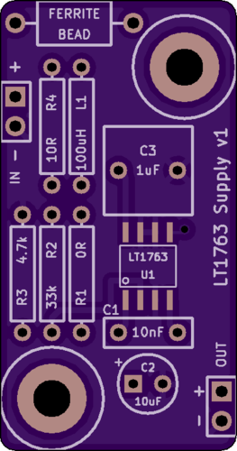
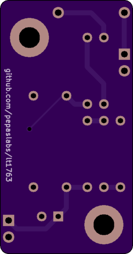
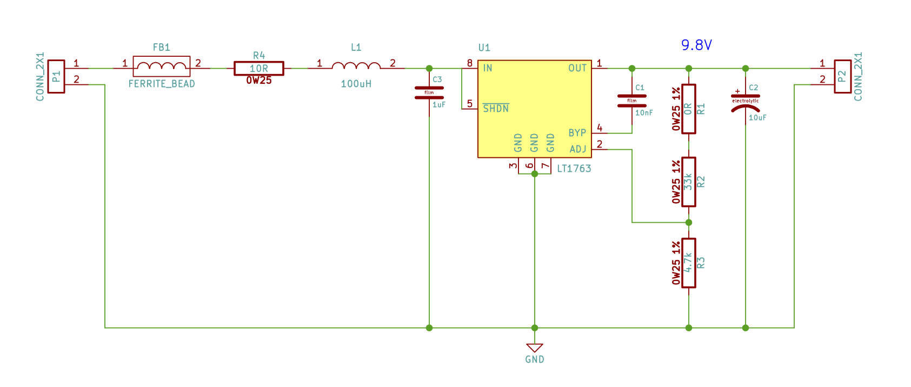
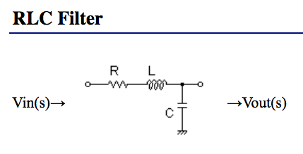
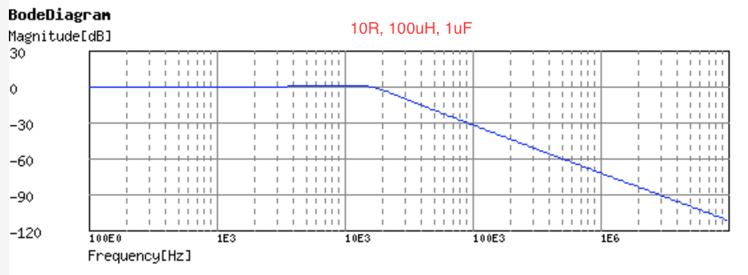
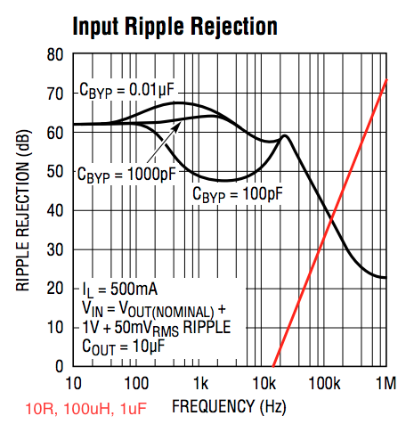
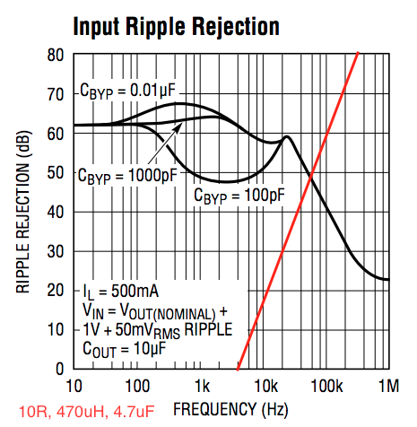

# lt1763

A low-noise supply based on the [LT1763](http://cds.linear.com/docs/en/datasheet/1763fh.pdf).

Schematic: [pdf](kicad/releases/v1/supply.pdf)

OSHPark: [link](https://oshpark.com/shared_projects/uVr4yDgz)

# Input filter

The board has provisions for an RLC input filter (see schematic components R4, L1, C3).

You can populate these components with whatever values you like.  I used [this RLC calculator](http://sim.okawa-denshi.jp/en/RLCtool.php) to analyze a few component values.

Note: C3 should be a film capacitor, e.g. Kemet R82 ([4.7uF](https://www.digikey.com/product-detail/en/kemet/R82CC4470AA30J/399-6028-ND/2704682), [1uF](https://www.digikey.com/product-detail/en/kemet/R82DC4100AA60J/399-5860-ND/2571295)).

Note: L1 should be a small-signal axial type ([470uH](https://www.digikey.com/product-detail/en/bourns-inc/78F471J-RC/M10142-ND/1306000), [100uH](https://www.digikey.com/product-detail/en/bourns-inc/78F101J-RC/M10136-ND/1305994)).

Note: A 10R resistor passing 30mA will add 0.3V of dropout.

## 10R, 100uH, 1uF

## 10R, 470uH, 4.7uF

# Mounting holes

The mounting holes are intended for use with M3 brass hex stand-offs.

# Lead spacing

The input and output leads fall on a 0.1" grid (breadboard compatible).